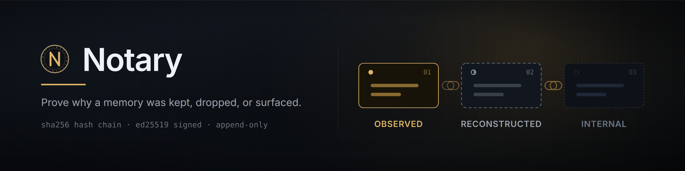
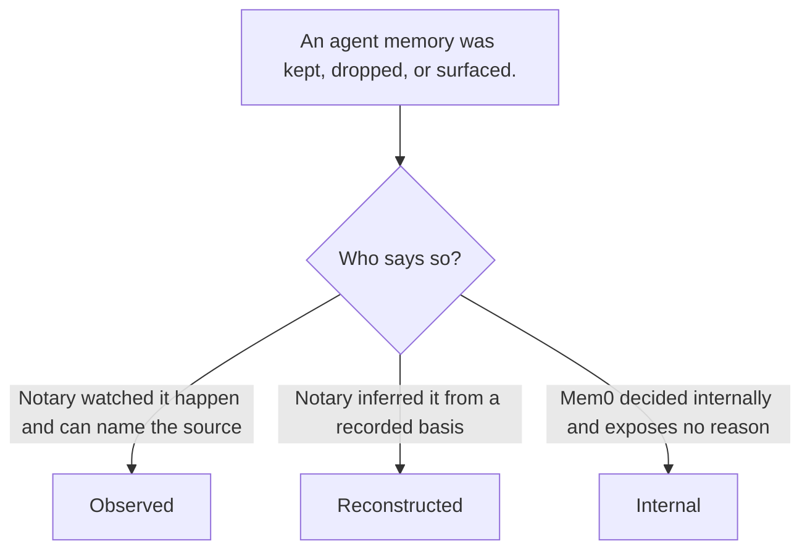
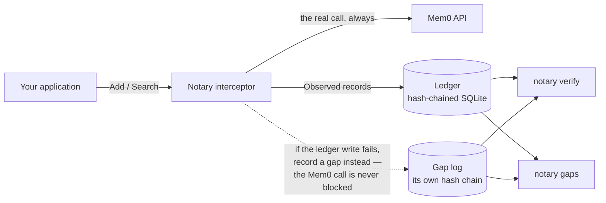

# Notary


-orange)

**A signed, tamper-evident audit trail for agent memory — one that records _why_ a memory was kept, dropped, or surfaced, not just that it was.**


Mem0 will tell you what it stored. It will not tell you why it *didn't* retrieve something — and for a
team under audit, "the model didn't return it" is not an answer anyone can accept.

Notary sits in front of your Mem0 calls and writes down what it witnessed, in a hash-chained ledger
you can verify offline. Where it cannot know the answer, it says so explicitly instead of guessing.

> **The central rule: every record is labelled with how Notary came to believe it.** A claim Notary
> watched happen is never presented with the same confidence as one it inferred — and a decision Mem0
> made privately is recorded as opaque, never dressed up as a reason.

---

## The three tiers



| Tier | Means | Example |
|---|---|---|
| **`Observed`** | Notary directly witnessed it. The source is recorded (`mem0_response` or `notary_instrumentation`). | `stored_by_mem0` — the memory appeared in a `get_all` listing. |
| **`Reconstructed`** | Notary inferred it. The basis and the rule version are recorded alongside. | `kept_by_content_match` — inferred from a content-hash match, not seen. |
| **`Internal`** | Mem0 decided internally and exposed no reason. An opacity marker, never a guess. | `removed_by_mem0` — history shows a DELETE with no reason given. |

This is enforced by construction, not by convention: `Observed`, `Reconstructed` and `Internal` are
built by **three separate constructors that take disjoint evidence types**. There is no builder that
accepts a tier as an argument, so "record a guess as a fact" does not type-check. Negative-compile
fixtures in `testdata/negative/` fail the build if anyone tries — including forging a tier, building a
`Reason` without a constructor, or fabricating `Observed` evidence from nothing.

---

## Architecture



One hash chain, written by the interceptor on the request path and by the reconciler off it. The gap
log is deliberately a **separate file with its own chain and its own signed checkpoints**: it exists
for the case where the store is unavailable, so sharing a store would defeat it.

---

## What it records

| Event | When | Tier |
|---|---|---|
| `add_requested` | an add is acknowledged by Mem0 | `Observed` |
| `add_resolved` | the add's outcome is later polled | `Observed` |
| `search_performed` | a search runs (query, filters, `top_k`, `threshold`, result count) | `Observed` |
| `memory_surfaced` | one record per returned memory, with its score and rank | `Observed` |
| `memory_kept` | a memory is seen in a listing, or inferred by content match | `Observed` / `Reconstructed` |
| `memory_dropped` | a memory known to exist was not returned, or history shows a removal | `Reconstructed` / `Internal` |
| `audit_gap` | the audit trail itself failed | `Observed` |

---

## Guarantees

**Tamper-evident chain.** Each record's hash covers its canonical bytes, its position, and its
predecessor's hash: `sha256("notary/record/v1" ‖ canonical ‖ uint64-BE seq ‖ prev-hash)`. Every
variable-length field is length-prefixed and every hash is domain-separated, so a field boundary
cannot be shifted to make two different records collide.

**Truncation detection.** A hash chain cannot see its own removed tail — what remains is
self-consistent. So `verify --write-checkpoint` emits a **signed head checkpoint**, and
`verify --checkpoint` fails loudly when the chain is shorter than the checkpoint attests. Plain
`verify` passes on a shortened chain by design; the checkpoint is what catches it.

**Fail-open-loud.** An audit-write failure must never break the customer's application. The Mem0 call
always completes; the failure is recorded durably in the gap log and mirrored to a loud channel. The
gap log has its own chain, so a gap cannot be silently erased.

**Idempotent by construction.** Idempotency keys are deterministic and content-derived — never
wall-clock, never random. Re-appending an existing key is a no-op that returns the existing record,
so retries and re-runs cannot duplicate the trail.

**No secrets in output.** Keys come from the environment only, and key material is redacted by
construction on every rendering path — `%v`, `%+v`, `%#v` and `json.Marshal` included — with a
canary test asserting it.

---

## Quickstart

```bash
go build ./...
go run ./cmd/notary version
```

`gaps` needs no configuration at all — it is read-only and requires no signing key:

```bash
go run ./cmd/notary gaps
```

`verify` needs a ledger, a signing key, and a keyring of trusted public keys (base64 ed25519 public
keys, one per line — the key ID is derived from the key, so the file can never disagree with itself):

```bash
export NOTARY_DB_PATH=notary.db
export NOTARY_TRUSTED_KEYS_PATH=trusted-keys.txt

go run ./cmd/notary verify                            # walk the chain
go run ./cmd/notary verify --write-checkpoint cp.json # attest the head
go run ./cmd/notary verify --checkpoint cp.json       # detect a removed tail
```

`export` renders a range of the ledger to stdout as JSONL — one stable object per record — so an audit
can be diffed, grepped and reviewed. It is a read path: it never writes the ledger, and its only
output of its own is the optional checkpoint file.

```bash
export NOTARY_DB_PATH=notary.db
export NOTARY_SIGNING_KEY=<base64 ed25519 key>

go run ./cmd/notary export --from 2026-09-01T00:00:00Z
go run ./cmd/notary export --from 2026-09-01T00:00:00Z --checkpoint-out cp.json
go run ./cmd/notary verify --checkpoint cp.json    # verify the range the export covers
```

- **A signing key is required**, even when `--checkpoint-out` is not given. Like `reconcile`, `export`
  refuses to start without one rather than silently downgrade, so a keyless stdout-only export is not
  possible in v1.
- **Sensitive content is withheld by default.** A line whose stored content is marked sensitive carries
  the subject's `content_hash` and `"redacted":"sensitive"` instead of the text, so a reader can always
  tell "not shown" from "nothing was there". `--include-sensitive` prints the stored text instead; it
  changes only what is printed — never a hash, because rendering is a read path.
- **`--checkpoint-out <path>`** writes a signed head checkpoint in the exact format
  `verify --checkpoint` already reads, attesting the ledger head at export time (not the last record in
  the range), so a truncated tail is detectable later.
- **`--phrase` is opt-in** and adds an optional, display-only language-model paraphrase beside each
  record — never instead of it. It is off by default, so a provider is only billed for an export you
  asked for. It needs provider configuration from the environment: `NOTARY_PHRASE_MODEL` and
  `NOTARY_PHRASE_BASE_URL`, plus `NOTARY_PHRASE_API_KEY` for endpoints that need one. A phrasing
  failure never fails the export; it degrades to a note on stderr.
- **Scope flags** `--user-id`, `--agent-id`, `--app-id` and `--run-id` restrict the export to one
  entity scope and combine with AND, mirroring `reconcile`.
- **`--from` is required** and `--to` defaults to now. The range is bounded on each record's *event*
  time (`At`), not its write time (`RecordedAt`), so a record written late about an old event still
  belongs to that event's window.
- **`--max-span`** caps the range (default 366 days). The cost of an export scales with the range, so
  an over-long range is an error rather than an out-of-memory kill.

Redaction follows content marked sensitive at **write** time. An application marks it either per call
(`library.Sensitive()`) or declaratively, by pointing `NOTARY_SENSITIVITY_RULES` at a YAML rules file:

```yaml
# Any rule that matches marks the record's content Sensitive at write time.
rules:
  - name: health-data
    match:
      scope:
        user_id: patient-42      # optional; omitted means any scope
      metadata:
        category: health         # matches a proxied add or a surfaced memory; see the note below
```

A rule matches when **every** clause it specifies matches, and a rule specifying neither clause is
rejected at load time. The rules file is read by the write paths — an application that constructs the
interceptor, and `notary proxy` — so there is no `export` flag for it: `export` writes no records.

One asymmetry matters when you write a rules file: **whether a `metadata:` clause can match an add
depends on the mode.** `library.Add`'s signature carries no metadata at all, so in library mode a rule
whose only clause is `metadata:` can never mark an add — only a `scope:` clause can. `notary proxy`
decodes each add's `metadata` from the request body, so the same rule CAN mark a proxied add. If the
content you mean to protect arrives through `library.Add`, match on `scope:`.

All configuration is environment-only:

| Variable | Purpose |
|---|---|
| `NOTARY_MEM0_API_KEY` | Mem0 API key |
| `NOTARY_MEM0_BASE_URL` | Mem0 base URL (default `https://api.mem0.ai`) |
| `NOTARY_DB_PATH` | ledger database (default `notary.db`) |
| `NOTARY_GAP_LOG_PATH` | gap log (default `notary-gaps.log`) |
| `NOTARY_SIGNING_KEY` | base64 ed25519 signing key — a 32-byte seed or a 64-byte private key. The key material goes **in** this variable; nothing reads an env var for its name. |
| `NOTARY_TRUSTED_KEYS_PATH` | file of trusted public keys |
| `NOTARY_SENSITIVITY_RULES` | path to a YAML sensitivity-rules file, read by the write paths (an application constructing an interceptor, and `notary proxy`); there is deliberately no CLI flag — see the export section |
| `NOTARY_PHRASE_BASE_URL` | OpenAI-compatible base URL for `--phrase` (required by `--phrase`) |
| `NOTARY_PHRASE_MODEL` | model name for `--phrase` (required by `--phrase`) |
| `NOTARY_PHRASE_API_KEY` | API key for `--phrase`; optional for endpoints that need none |

---

## Status

This is the **core ledger, the reconciler, `export`, `replay`, `explain` and `proxy`: phases 1–9** of the design, complete and tested.

**Working today**

- Record schema, unforgeable tiers, canonical hashing, negative-compile fixtures
- SQLite store, hash-chained writes, crash safety, idempotent append
- Signing, keyring, signed head checkpoints, cross-domain replay protection
- `notary verify` (chain, truncation, gap cross-check) and `notary gaps`
- Gap log with its own chain and signed checkpoints
- Fail-open-loud interceptor and the in-process Mem0 interceptor (`Add`, `Search`)
- Gap reconciliation as a library API (`AuditWriter.ReplayGaps`) — **no CLI** yet, because a gap
  entry records which record is missing, not the record itself, so replay needs the caller's records
- **`notary reconcile`** — a one-shot, schedulable pass that derives and records the claims the
  ledger cannot observe directly: it polls Mem0 for unresolved adds, enumerates a scope to classify
  memories as kept or removed, and reads recorded searches to classify a memory the search did not
  return as dropped. It is bounded by `--since` (on each record's event time, not its write time) and
  the four scope flags, supports `--dry-run`, and keys every derived claim on its subject and reason
  kind (the rule version, where a rule justifies the inference) rather than on the run, so re-running
  it against an unchanged store appends nothing. Every
  inference is named by a rule in a versioned registry. `notary reconcile` is the first command to
  consume `NOTARY_MEM0_API_KEY`.
- **`notary export`** — streams a range of the ledger to stdout as JSONL, one stable object per
  record, and (with `--checkpoint-out`) writes a signed head checkpoint that `verify --checkpoint`
  reads back. It is bounded by `--from`/`--to` (on each record's event time, not its write time) and
  the four scope flags, and capped by `--max-span`. Sensitive content is withheld by default and its
  line says so; `--include-sensitive` prints it and changes no hash. `--phrase` adds an opt-in,
  display-only paraphrase that degrades to a note rather than failing the export. Like `reconcile`,
  it requires a signing key even when it writes no checkpoint.
- **`notary replay`** — streams the ledger as it stood at one instant to stdout as JSONL, one stable
  object per record, byte-identical to an exported line: the records whose `RecordedAt` (the write
  time — the knowledge instant — not the event time) is at or before the required `--at`, in Seq
  order, verified as a chain prefix before they are written. The four scope flags restrict the replay
  to one entity scope, and an unparseable `--at` is refused rather than silently treated as now.
  Sensitive content is withheld by default and its line says so; `--include-sensitive` prints it and
  changes no hash. Because it verifies rather than signs, it requires a trusted-key file and no
  signing key, and it reports any break in the prefix on stderr and exits non-zero, leaving stdout as
  the JSONL stream it promised.
- **`notary explain`** — answers one question about the ledger as prose: why a single record was
  written, or what happened to a single memory over its life. The subject is one `<record-id>`
  argument or `--memory <mem0-id>`, never both, and the memory view renders one line per record in
  Seq order. `--json` prints the same records, in the same order, as one small JSON object instead
  of prose: `{"records": [...]}`, each record carrying `seq`, `id`, `memory_id`, `event`,
  `reason_kind`, `tier`, `at`, `recorded_at` and `sentence`, plus `content` only when the record
  carried content that was shown and `redacted` only when content was withheld. Sensitive content is
  withheld by default and the view says so; `--include-sensitive` prints it and changes no hash. It
  is a read path that signs and verifies nothing, so it needs neither a signing key nor a trusted-key
  file.
- **`notary proxy`** — serves Mem0 traffic and records the `add` and `search` requests that pass through
  it. The application re-points its Mem0 base URL at Notary, which forwards every request to the real
  Mem0 and returns the response untouched, recording the same records library mode records for those two
  endpoints (the mode differences are noted under sensitivity rules above), with no code
  change in the application, in any language. `get_all`, history, event-status and delete pass through
  unrecorded by design. It needs a signing key (`NOTARY_SIGNING_KEY`, because ledger appends are signed),
  the upstream base URL from `NOTARY_MEM0_BASE_URL`, and the ledger and gap log paths (`NOTARY_DB_PATH`,
  `NOTARY_GAP_LOG_PATH`); its sensitivity rules come from `NOTARY_SENSITIVITY_RULES` with no flag. It
  needs **no** Mem0 API key — it forwards the caller's own `Authorization` header and holds no credential
  of its own. Its flags are `--addr`, `--queue-depth` and `--max-body`, and its stdout is unused: the
  listen banner and every drop marker go to stderr.

**Not built yet** — the README will be updated as these land rather than describing intent as fact

- **`ReconcileMode.InProcess`** — a reconcile mode that is **reserved, not implemented**: it is
  defined and explicitly rejected by validation, so a caller that runs only what this build
  implements gets a matchable error. `notary reconcile` is the one-shot command mode; no long-running
  in-process driver exists

There is no `LICENSE` file yet. Until one is added, all rights are reserved by default.

---

## Development

```bash
go build ./...     # builds clean
go vet ./...       # clean
gofmt -l .         # no output expected
go test ./...
```

`go test ./...` runs sixteen packages. `internal/ledger` is the slow one (a subprocess crash test
SIGKILLs a writer mid-transaction, ~30s), so a full run takes a couple of minutes — run packages
individually if you are on a short timeout.

Tests never touch the network. The Mem0 client is tested against **recorded response fixtures** in
`internal/mem0/testdata/`, whose provenance is documented in `FIXTURES.md`. A live test is opt-in
behind a build tag and is never a gate.

That one live test exists because of what fixtures provably cannot catch: that a real add is resolved
**and** certified kept by a **single** reconcile pass, and that re-running appends nothing. It sits
behind the `mem0live` build tag, so `go test ./...` never compiles it and CI never runs it:

```bash
NOTARY_MEM0_API_KEY=... go test -tags mem0live -count=1 -run TestLive -v ./internal/reconcile/
```

It needs the network, a real key, and real Mem0 seconds, so run it deliberately rather than routinely.
`-count=1` is not decoration either: without it a re-run **replays the cached result** and prints
`ok (cached)`, a pass that never touched Mem0 — the same fiction as a skipped test reporting success.
It writes only to a scope it mints itself from a random suffix, and that generated scope is the only
one it ever hands to Mem0; each deletion is re-checked against it locally rather than trusting the
service to honour a filter. It wipes the scope afterwards when it passed or failed — barring a kill,
or a listing it could not read.

### The README banner

`docs/assets/banner.svg` is the source; `docs/assets/banner.png` is the rendered 2x raster that the
README actually displays. If you edit the SVG, re-render the PNG or the two will disagree:

```bash
google-chrome --headless --disable-gpu --force-device-scale-factor=2 --hide-scrollbars \
  --window-size=1600,400 --screenshot=docs/assets/banner.png docs/assets/banner.svg
```

The PNG is committed rather than referenced as an SVG because an SVG renders with the *viewer's*
fonts — on a machine without Inter, the fallback would reflow the text.

