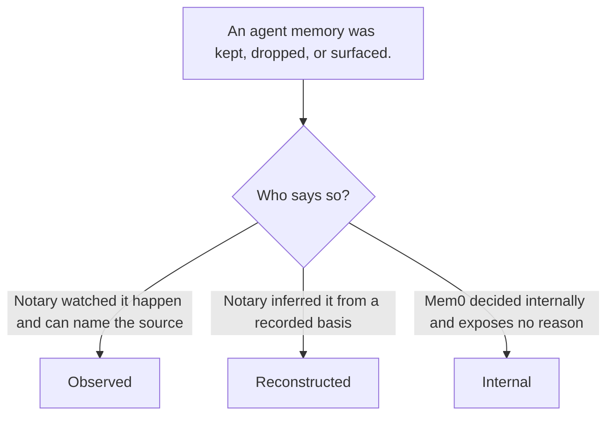
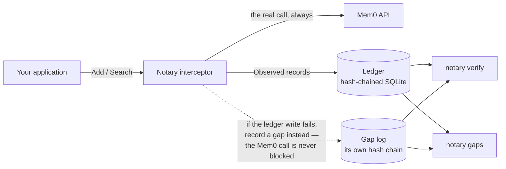

# Notary


-orange)

**A signed, tamper-evident audit trail for agent memory — one that records _why_ a memory was kept, dropped, or surfaced, not just that it was.**


Mem0 will tell you what it stored. It will not tell you why it *didn't* retrieve something — and for a
team under audit, "the model didn't return it" is not an answer anyone can accept.

Notary sits in front of your Mem0 calls and writes down what it witnessed, in a hash-chained ledger
you can verify offline. Where it cannot know the answer, it says so explicitly instead of guessing.

> **The central rule: every record is labelled with how Notary came to believe it.** A claim Notary
> watched happen is never presented with the same confidence as one it inferred — and a decision Mem0
> made privately is recorded as opaque, never dressed up as a reason.

---

## The three tiers



| Tier | Means | Example |
|---|---|---|
| **`Observed`** | Notary directly witnessed it. The source is recorded (`mem0_response` or `notary_instrumentation`). | `stored_by_mem0` — the memory appeared in a `get_all` listing. |
| **`Reconstructed`** | Notary inferred it. The basis and the rule version are recorded alongside. | `kept_by_content_match` — inferred from a content-hash match, not seen. |
| **`Internal`** | Mem0 decided internally and exposed no reason. An opacity marker, never a guess. | `removed_by_mem0` — history shows a DELETE with no reason given. |

This is enforced by construction, not by convention: `Observed`, `Reconstructed` and `Internal` are
built by **three separate constructors that take disjoint evidence types**. There is no builder that
accepts a tier as an argument, so "record a guess as a fact" does not type-check. Negative-compile
fixtures in `testdata/negative/` fail the build if anyone tries — including forging a tier, building a
`Reason` without a constructor, or fabricating `Observed` evidence from nothing.

---

## Architecture



One hash chain, written by the interceptor on the request path and by the reconciler off it. The gap
log is deliberately a **separate file with its own chain and its own signed checkpoints**: it exists
for the case where the store is unavailable, so sharing a store would defeat it.

---

## What it records

| Event | When | Tier |
|---|---|---|
| `add_requested` | an add is acknowledged by Mem0 | `Observed` |
| `add_resolved` | the add's outcome is later polled | `Observed` |
| `search_performed` | a search runs (query, filters, `top_k`, `threshold`, result count) | `Observed` |
| `memory_surfaced` | one record per returned memory, with its score and rank | `Observed` |
| `memory_kept` | a memory is seen in a listing, or inferred by content match | `Observed` / `Reconstructed` |
| `memory_dropped` | a memory known to exist was not returned, or history shows a removal | `Reconstructed` / `Internal` |
| `audit_gap` | the audit trail itself failed | `Observed` |

---

## Guarantees

**Tamper-evident chain.** Each record's hash covers its canonical bytes, its position, and its
predecessor's hash: `sha256("notary/record/v1" ‖ canonical ‖ uint64-BE seq ‖ prev-hash)`. Every
variable-length field is length-prefixed and every hash is domain-separated, so a field boundary
cannot be shifted to make two different records collide.

**Truncation detection.** A hash chain cannot see its own removed tail — what remains is
self-consistent. So `verify --write-checkpoint` emits a **signed head checkpoint**, and
`verify --checkpoint` fails loudly when the chain is shorter than the checkpoint attests. Plain
`verify` passes on a shortened chain by design; the checkpoint is what catches it.

**Fail-open-loud.** An audit-write failure must never break the customer's application. The Mem0 call
always completes; the failure is recorded durably in the gap log and mirrored to a loud channel. The
gap log has its own chain, so a gap cannot be silently erased.

**Idempotent by construction.** Idempotency keys are deterministic and content-derived — never
wall-clock, never random. Re-appending an existing key is a no-op that returns the existing record,
so retries and re-runs cannot duplicate the trail.

**No secrets in output.** Keys come from the environment only, and key material is redacted by
construction on every rendering path — `%v`, `%+v`, `%#v` and `json.Marshal` included — with a
canary test asserting it.

---

## Quickstart

```bash
go build ./...
go run ./cmd/notary version
```

`gaps` needs no configuration at all — it is read-only and requires no signing key:

```bash
go run ./cmd/notary gaps
```

`verify` needs a ledger, a signing key, and a keyring of trusted public keys (base64 ed25519 public
keys, one per line — the key ID is derived from the key, so the file can never disagree with itself):

```bash
export NOTARY_DB_PATH=notary.db
export NOTARY_TRUSTED_KEYS_PATH=trusted-keys.txt

go run ./cmd/notary verify                            # walk the chain
go run ./cmd/notary verify --write-checkpoint cp.json # attest the head
go run ./cmd/notary verify --checkpoint cp.json       # detect a removed tail
```

All configuration is environment-only:

| Variable | Purpose |
|---|---|
| `NOTARY_MEM0_API_KEY` | Mem0 API key |
| `NOTARY_MEM0_BASE_URL` | Mem0 base URL (default `https://api.mem0.ai`) |
| `NOTARY_DB_PATH` | ledger database (default `notary.db`) |
| `NOTARY_GAP_LOG_PATH` | gap log (default `notary-gaps.log`) |
| `NOTARY_SIGNING_KEY` | base64 ed25519 signing key — a 32-byte seed or a 64-byte private key. The key material goes **in** this variable; nothing reads an env var for its name. |
| `NOTARY_TRUSTED_KEYS_PATH` | file of trusted public keys |

---

## Status

This is the **core ledger and the reconciler: phases 1–5** of the design, complete and tested.

**Working today**

- Record schema, unforgeable tiers, canonical hashing, negative-compile fixtures
- SQLite store, hash-chained writes, crash safety, idempotent append
- Signing, keyring, signed head checkpoints, cross-domain replay protection
- `notary verify` (chain, truncation, gap cross-check) and `notary gaps`
- Gap log with its own chain and signed checkpoints
- Fail-open-loud interceptor and the in-process Mem0 interceptor (`Add`, `Search`)
- Gap reconciliation as a library API (`AuditWriter.ReplayGaps`) — **no CLI** yet, because a gap
  entry records which record is missing, not the record itself, so replay needs the caller's records
- **`notary reconcile`** — a one-shot, schedulable pass that derives and records the claims the
  ledger cannot observe directly: it polls Mem0 for unresolved adds, enumerates a scope to classify
  memories as kept or removed, and reads recorded searches to classify a memory the search did not
  return as dropped. It is bounded by `--since` (on each record's event time, not its write time) and
  the four scope flags, supports `--dry-run`, and keys every derived claim on its subject and reason
  kind (the rule version, where a rule justifies the inference) rather than on the run, so re-running
  it against an unchanged store appends nothing. Every
  inference is named by a rule in a versioned registry. `notary reconcile` is the first command to
  consume `NOTARY_MEM0_API_KEY`.

**Not built yet** — the README will be updated as these land rather than describing intent as fact

- **Proxy mode** (an HTTP proxy in front of Mem0) — library mode only today
- **`ReconcileMode.InProcess`** — a reconcile mode that is **reserved, not implemented**: it is
  defined and explicitly rejected by validation, so a caller that runs only what this build
  implements gets a matchable error. `notary reconcile` is the one-shot command mode; no long-running
  in-process driver exists
- **`export`** and redaction-at-render
- **`replay`** and **`explain`**

There is no `LICENSE` file yet. Until one is added, all rights are reserved by default.

---

## Development

```bash
go build ./...     # builds clean
go vet ./...       # clean
gofmt -l .         # no output expected
go test ./...
```

`go test ./...` runs eleven packages. `internal/ledger` is the slow one (a subprocess crash test
SIGKILLs a writer mid-transaction, ~30s), so a full run takes a couple of minutes — run packages
individually if you are on a short timeout.

Tests never touch the network. The Mem0 client is tested against **recorded response fixtures** in
`internal/mem0/testdata/`, whose provenance is documented in `FIXTURES.md`. A live test is opt-in
behind a build tag and is never a gate.

### The README banner

`docs/assets/banner.svg` is the source; `docs/assets/banner.png` is the rendered 2x raster that the
README actually displays. If you edit the SVG, re-render the PNG or the two will disagree:

```bash
google-chrome --headless --disable-gpu --force-device-scale-factor=2 --hide-scrollbars \
  --window-size=1600,400 --screenshot=docs/assets/banner.png docs/assets/banner.svg
```

The PNG is committed rather than referenced as an SVG because an SVG renders with the *viewer's*
fonts — on a machine without Inter, the fallback would reflow the text.

